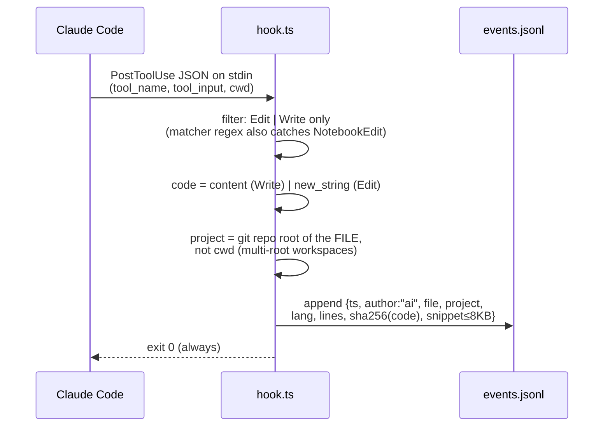
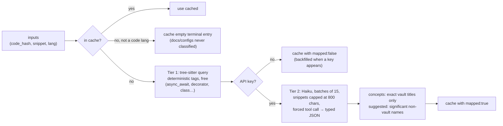
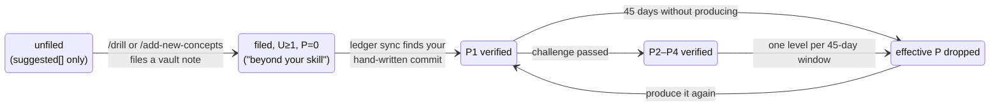
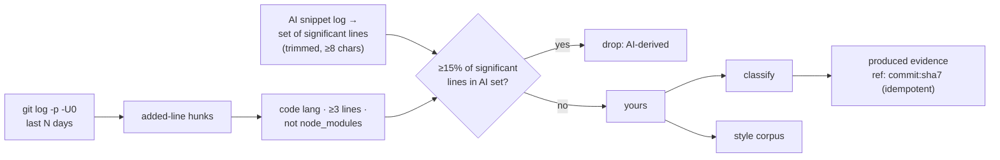

# How AI Mirror Works

An implementation-level tour of the whole system — written so you could rebuild it from scratch. Per-command detail lives in [commands.md](commands.md); the *why* lives in [CONCEPTS.md](../CONCEPTS.md).

## The one-paragraph version

A hook logs every AI edit as it happens (**capture**). A lazy, cached classifier maps that code to concept notes in your Obsidian vault (**classify**). A ledger tracks, per concept, whether you *understand* it (U, from the vault) and whether you can *produce* it unaided (P, earned only by hand-written code) (**ledger**). Everything else is a consumer: the **report** shows the gap between what you ship and what you can produce, the **tutor** softens generation for unearned concepts at prompt time, the **gate** re-checks everything at commit time, **challenges** are the proctored way to raise P, and the **style** pipeline distills your verified hand-written code into a profile so allowed AI generation sounds like you.

## System map

```mermaid
flowchart TB
    subgraph session["Claude Code session"]
        edit["AI Edit/Write"]
        prompt["User prompt"]
    end

    subgraph hooks["Hooks (instant, local, no LLM)"]
        capture["PostToolUse hook<br/>src/hook.ts"]
        tutor["UserPromptSubmit hook<br/>src/tutor.ts"]
    end

    subgraph data["~/.skillgate/data"]
        events[("events.jsonl<br/>provenance log")]
        cache[("classify-cache.json")]
        skills[("skills.json<br/>the ledger")]
        samples[("style/samples.jsonl")]
        overrides[("overrides.jsonl")]
        gatelog[("gate.jsonl")]
    end

    vault[("Obsidian vault<br/>concepts/*.md")]
    git[("git history<br/>of your repos")]

    edit --> capture --> events
    prompt --> tutor
    skills -.reads.-> tutor
    tutor -->|"injects tutor mode + style digest"| session

    classifier["classifier.ts<br/>Tier 1: tree-sitter tags<br/>Tier 2: batched Haiku → vault titles"]
    events --> classifier
    vault -.titles.-> classifier
    classifier --> cache

    sync["sync.ts + handwritten.ts<br/>commits − AI lines = yours"]
    git --> sync
    events -.AI line set.-> sync
    sync -->|"produced evidence (P1)"| skills
    sync --> samples

    report["mirror report"]
    cache --> report
    skills --> report
    overrides --> report

    challenge["mirror challenge<br/>sandbox → provenance check → LLM grade"]
    challenge -->|"verified P2–P4"| skills
    events -.void check.-> challenge

    gate["pre-commit gate<br/>advisory, never blocks"]
    cache --> gate
    skills --> gate
    gate --> gatelog

    style["style --rebuild<br/>Sonnet distills traits"]
    samples --> style
    style -->|digest| tutor
```

## The data files

Everything is flat JSON/JSONL — human-readable, git-diffable, schema-ready for Postgres later ([pg-migration.md](pg-migration.md)). All schemas live in one place: `src/types.ts`.

| File | Shape | Written by | Invariant |
|---|---|---|---|
| `events.jsonl` | `MirrorEvent` per line | capture hook only | **append-only, immutable** — classification never writes here |
| `classify-cache.json` | `code_hash → CacheEntry` | classifier | same hash never re-sent to the LLM |
| `skills.json` | `concept → LedgerEntry` | sync, challenge, U-sync | stored P never destroyed; decay computed at read |
| `style/samples.jsonl` | `StyleSample` per line | sync | only provenance-verified hunks; deduped by hash |
| `style/profile.json`, `style-guide.md`, `digest.md` | distilled traits | `style --rebuild` | regenerated whole, derived data |
| `overrides.jsonl` | `{ts, concept, project, reason}` | `override` | append-only |
| `gate.jsonl` | one advisory per commit | `gate check` | append-only |
| `challenges/<slug>/` | `meta.json` + README + solution | `challenge` | AI events inside = attempt void |

Config lives outside the data dir: `mirror.config.json` in the repo root (`data_dir`, optional `projects[]` for repos the AI never touched) and `~/.claude/vault-config.json` (`vault_path`, optional `archive_vault_path`).

## Pipeline 1 — Capture (write time, every AI edit)

The provenance foundation. Deliberately dumb and fast: parse stdin, append one line, exit. No LLM, no network, no API key — nothing that could fail or slow an edit.



**The provenance signal is the absence of events:** code you type yourself never fires the hook. Known blind spots by design — Copilot, browser paste, Bash heredocs. The gate (pipeline 5) is the net that catches those at commit time.

## Pipeline 2 — Classify (lazy, cached, tiered)

Never runs in the hook. Runs at report/gate time, only over hashes not in the cache.



Two design decisions worth copying:

- **The vault is the canonical namespace.** The LLM sees the exact vault titles and its answers are filtered to that set — anything else it reached for lands in `suggested[]`, which is the raw material for `mirror gaps`. Concepts and suggestions never mix.
- **Forced tool calls everywhere.** Every LLM interaction (classify, style distill, challenge generate, challenge grade) uses `tool_choice: {type: "tool"}` so the response is schema-validated JSON, never free text to parse.

A failed batch stays uncached and retries next run. Entries cached without a key (`mapped: false`) are backfilled when a key appears.

## Pipeline 3 — The ledger: U, P, and decay

The core model. Per concept:

- **U (understanding, 0–3)** — mirrored from the vault note's `confidence:` frontmatter (`learning=1, solid=2, fluent=3`). The vault owns U; the ledger never edits it.
- **P (coding ability, 0–4)** — earned *only* by producing code. Two sources of `produced` evidence: commit-inference (caps at P1 — presence proven, mastery not) and challenges (the only path to P2–P4).
- **Effective P** = stored P minus one level per full 45-day window since `last_produced`. Computed at read time; stored values never destroyed. Knowing ≠ remembering.



**You can't file your way to P.** A vault note raises U only. This is what stops stubbing a fake note to silence the tutor — the unlock *is* writing the code.

### P-inference (`ledger sync`)



The threshold is strict (15%, not 50%) because these hunks also feed the style profile — a hunk that's even a fifth AI-derived shouldn't teach the profile the model's own habits. Honest limit: exact-line matching, so heavily reworded AI code can slip through; the formal challenges are the airtight path.

## Pipeline 4 — The tutor (prompt time)

Pure functions, no I/O beyond loading the ledger and digest, no LLM — it runs on *every* prompt, so it must be instant, and conservative (a false trigger erodes trust; a miss just means the report catches it later).

```mermaid
sequenceDiagram
    participant U as User prompt
    participant T as UserPromptSubmit hook
    participant L as skills.json
    participant S as Claude session

    U->>T: prompt text
    T->>T: code intent? (keyword regex —<br/>implement, fix, refactor, build…)
    alt no code intent
        T-->>S: silence
    end
    T->>L: load ledger
    T->>T: match concept titles against prompt<br/>(verbatim, or all/all-but-one title tokens)
    T->>T: keep hits with effective P = 0<br/>or claimed-only (cap 3)
    alt hits exist
        T-->>S: inject tutor block: default to hints/<br/>pseudocode/skeleton for these; on explicit<br/>request give full code + log `mirror override`
    end
    T-->>S: inject style digest (≤600 chars) if built
```

The policy the injection carries: **never refuse, never withhold after an explicit request, never lecture beyond one line.** The override is a witness, not a wall. The 10-minute alternative (`/drill`) is always named.

## Pipeline 5 — The gate (commit time)

The universal net: assesses everything staged *regardless of author*, so the capture hook's blind spots don't survive to commit.

```mermaid
sequenceDiagram
    participant G as git commit
    participant P as pre-commit hook
    participant C as gate check
    participant D as data files

    G->>P: pre-commit fires
    P->>P: chained foreign hook runs FIRST<br/>(keeps its blocking power)
    P->>C: mirror gate check (|| true)
    C->>C: git diff --cached -U0 → code hunks ≥3 lines
    C->>D: staged-AI% = share of significant lines<br/>matching the AI snippet log
    C->>D: classify (cache first; uncached: ONE LLM<br/>call, 5s timeout, 0 retries)
    C->>C: judge concepts vs ledger —<br/>unknown concept = beyond by definition
    C->>D: append advisory to gate.jsonl
    C-->>G: print advisory · ALWAYS exit 0
```

Invariants that make it trustworthy enough to leave installed:

- **Never blocks, fails open** — no key, timeout, any error → silence, never a broken commit. A timed-out hunk stays uncached and gets classified at the next report instead.
- **Chains, never replaces** — an existing pre-commit hook runs first with its own exit code respected.
- **Silent without a Tier-2 verdict** — syntax tags alone aren't enough to accuse; if nothing was LLM-mapped it says "nothing checked" rather than guessing.
- Every advisory lands in `gate.jsonl` — the dataset that decides whether a blocking mode is ever justified. *Build the mirror first; earn the right to build the wall.*

## Pipeline 6 — Challenges (earning P2–P4)

Provenance-proctored exercises. Generation targets `effective P + 1` (capped at 4). The sandbox rule is the whole trick: the capture hook logs every AI edit by path, so "no AI events inside this directory" is a *proof* of authorship, not an honor system. Grading checks provenance first, rubric second; a pass writes `produced` evidence at the attempted level.

## Pipeline 7 — Style

Verified hand-written hunks (pipeline 3) accumulate in `samples.jsonl`. `style --rebuild` groups them per language (newest first, 60k-char cap), has Sonnet describe observable traits — naming, function shape, error handling, comments, structure, idioms, notable absences — and writes the profile, a human-readable guide, and a ≤600-char digest that the tutor hook injects into code prompts. The loop: *your* verified code teaches the AI to write like you, and only verified code is allowed to teach.

## Companion skills (the human loop)

The CLI produces data; three installed skills close the loop inside Claude Code: **/gaps** reads `mirror gaps --json` and routes every gap (file it / drill it / deep-dive / import from archive), **/drill** is the 10-minute learn-and-earn (files the vault note = U, you hand-type an exercise and `ledger sync` credits it = P), **/mirror-week** is the Friday ritual around the report. The `~/.claude/CLAUDE.md` policy block makes every session honor the tutor injection.

## Rebuild roadmap

The dependency-ordered path if you rewrite this from scratch. Each stage is independently useful — that's what makes the build tractable.

| Stage | Build | Proves | Needs |
|---|---|---|---|
| 1 | `types.ts`, config, the capture hook + `events.jsonl` | events appear when the AI edits | nothing |
| 2 | tiered classifier + cache | same code never classified twice | stage 1 |
| 3 | vault reader + ledger (U sync, effective P, decay) | `ledger` shows U/P per concept | 2 |
| 4 | P-inference (`handwritten.ts`, `sync.ts`) | your commits earn P1 + style samples | 3 |
| 5 | the report | the weekly mirror renders | 2–4 |
| 6 | `gaps` + the skills | gaps route to learning | 5 |
| 7 | tutor hook | unearned concepts get hints by default | 3 |
| 8 | challenges | P2–P4 earnable, provenance-proctored | 3, and stage 1's event log for the void check |
| 9 | style distillation | generated code sounds like you | 4 |
| 10 | the gate | commit-time advisory, fails open | 2, 3 |

Principles worth keeping regardless of implementation choices:

1. **Capture must be free.** No LLM, no network, nothing that can fail, in the write path.
2. **Classify lazily, cache by content hash.** The cache is the cost model.
3. **The vault is the only concept namespace.** The LLM proposes; exact titles dispose.
4. **P is produced, never declared.** And it decays — computed at read time, never destroyed at rest.
5. **Never block, never refuse.** Witness (overrides, gate.jsonl) instead of walls, until the data earns the wall.
6. **Forced tool calls for every LLM response.** Typed JSON in, typed JSON out.
7. **Flat append-only files.** Debuggable with `cat`, portable to a real database later.
